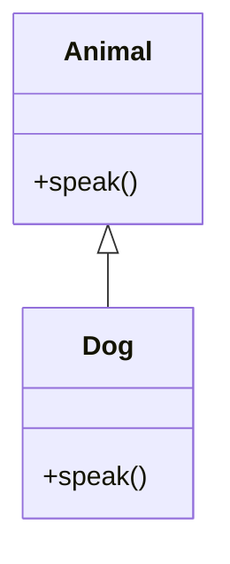

# 🧩 Code-to-Diagram AI  

An **AI-powered tool** that converts source code snippets into **visual diagrams** using **Google Gemini 2.5 Pro API** and **Mermaid.js**.  

This project helps developers and teams quickly understand codebases by automatically generating **UML class diagrams, flowcharts, and sequence diagrams**, saving time in **documentation, debugging, and architecture design**.  

---

## ✨ Features
- ✅ Supports **multiple programming languages** (Python & JavaScript initially)  
- ✅ Generates **UML class diagrams, flowcharts, and sequence diagrams**  
- ✅ Real-time preview with **Mermaid.js rendering**  
- ✅ Export options: **SVG, PNG, Markdown embed**  
- ✅ Clean, responsive UI built with **TailwindCSS**  
- ✅ Powered by **Google Gemini 2.5 Pro Inference API**  
- ✅ Integrated **Monaco Editor** for smooth developer experience  

---

## 🛠️ Tech Stack
- **Frontend** → React + TailwindCSS + Mermaid.js  
- **Backend** → Node.js + Express  
- **AI Engine** → Google Gemini 2.5 Pro API (via REST API)  
- **Code Editor** → Monaco Editor  

---

## ⚡ Getting Started  

### 🔹 Prerequisites
- [Node.js](https://nodejs.org/) (v16 or higher)  
- A **Google Gemini API key** (free tier available via [Google AI Studio](https://ai.google.dev/))  

---

### 🔹 Installation
1. **Clone the repository**
   ```bash
   git clone https://github.com/your-username/code-to-diagram-ai.git
   cd code-to-diagram-ai
   ```

2. **Install dependencies**
   ```bash
   npm run install-all
   ```

3. **Set up environment variables**  
   Copy the environment file template:
   ```bash
   cp backend/.env.example backend/.env
   ```
   Add your **Gemini API key** to `.env`:
   ```
   GEMINI_API_KEY=your_gemini_token_here
   ```

4. **Start the development servers**
   ```bash
   npm run dev
   ```

---

## 💻 Usage
1. Open your browser and go to → [http://localhost:3000](http://localhost:3000)  
2. Paste your **source code snippet** into the editor  
3. Select the **programming language** and **diagram type** (class, flowchart, sequence)  
4. Click **Generate Diagram**  
5. View the generated diagram in real time  
6. Export the diagram as **SVG, PNG, or Markdown embed**  

---

## 📂 Project Structure
```
code-to-diagram-ai/
├── frontend/          # React application (UI + Mermaid rendering)
├── backend/           # Express API server (handles Gemini API calls)   
└── README.md          # Project documentation
```

---

## 🔌 API Endpoints

### 1️⃣ Generate Diagram
**POST** `/api/generate-diagram`  
- **Description** → Takes code, language, and diagram type → Returns Mermaid.js diagram code  

**Request body:**
```json
{
  "code": "class Animal { def speak(self): pass }",
  "language": "python",
  "diagramType": "class"
}
```

**Response:**
```json
{
  "diagram": "classDiagram\nclass Animal {\n+speak()\n}"
}
```

---

### 2️⃣ Export Diagram
**POST** `/api/export/:format`  
- **Description** → Export the generated diagram  
- **Formats** → `svg`, `png`, `md`  

---

## 📖 Example Workflow  

**Input (Python code):**
```python
class Animal:
    def speak(self):
        pass

class Dog(Animal):
    def speak(self):
        print("Woof!")
```

**Generated Mermaid Code:**


**Rendered Diagram:**  
👉 Shows **Animal → Dog (inheritance)** relationship  

---

## 🚀 Future Enhancements
- 🔹 Support for more programming languages (Java, C++, Go, etc.)  
- 🔹 Auto-detect best diagram type  
- 🔹 Natural language queries (“Show me the function call graph”)  
- 🔹 GitHub repo integration for large-scale diagrams  
- 🔹 Collaboration mode for teams (share diagrams in real time)  

---

## 🤝 Contributing
We welcome contributions!  

1. Fork the repository  
2. Create a feature branch (`git checkout -b feature/your-feature`)  
3. Commit your changes (`git commit -m "Add new feature"`)  
4. Push to your branch (`git push origin feature/your-feature`)  
5. Submit a Pull Request  

---

## 📜 License
This project is licensed under the **MIT License** – feel free to use and modify.  
